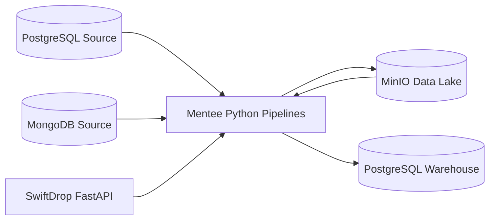

# Architecture

## Why MinIO Is Used

MinIO represents a local data lake. You may use a medallion architecture to organize data as it moves from source extracts through transformed datasets and into the warehouse.
